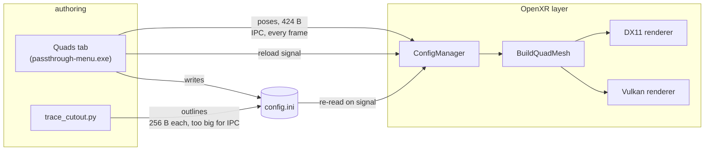
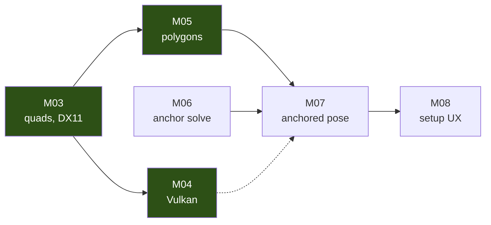

# Cockpit passthrough cutouts — plan

Working plan for adding world-anchored, arbitrary-shaped passthrough cutouts to
[openxr-steamvr-passthrough](https://github.com/Rectus/openxr-steamvr-passthrough),
for mixed-reality flight simulation in DCS World and X-Plane 12.

Hardware: Bigscreen Beyond 2e (Lighthouse), ELP-3DGS1200P01-V100 dual-lens USB camera,
three WinCtrl 1024x768 USB display panels mounted portrait.

---

## The goal

Show real instrument panels through a virtual cockpit, cut to any shape, aligned to the
physical hardware, **without editing aircraft textures or modding aircraft**.

## The design, as agreed

**The cutout IS the projection surface.** One object, not two.

A cutout is a shape positioned in 3D at the real panel's pose. It does two jobs at once:

1. it defines where passthrough is *visible* — the hole in the virtual cockpit
2. it defines where the camera image is *projected* — the geometry it lands on

These cannot be separated. A hole in screen space would leave the camera image painted
on the projection cylinder at `ProjectionDistanceFar` (10 m by default) while the real
panel is 0.7 m away, so the panel slides around as the head moves. Putting the shape at
the panel's true pose makes the hole and the image move together, because they are the
same geometry.

**No chroma key required.** The polygon is the mask. Existing chroma-key/`Masked` support
stays for anyone who wants it, but the texture-editing path is not the plan - too much
work, too fragile.

**Occlusion falls out of the existing depth path.** The polygon is real geometry at a
real pose, so it writes geometrically exact depth. Where an app submits depth
(`XR_KHR_composition_layer_depth`), virtual objects in front of the panel occlude the
passthrough correctly. Where it does not, `GET_DEPTH_STENCIL_STATE` already selects the
disabled state and passthrough draws on top. Both cases work today.

This is a real advantage over reaching the same feature through stereo depth
reconstruction, which was tried and was unusable - "like there is water on the screen".
Per-pixel stereo depth is noisy; an anchored polygon's depth is exact and free.

### Depth is the dominant error, not shape

The camera sits ~15 cm from the eye (`Camera0_Translation` = -0.031, -0.047, -0.138).
That offset is a parallax baseline, so reprojecting the camera image to the eye requires
assuming a depth, and a wrong assumption displaces the image:

    angular error ~= baseline * |1/d_true - 1/d_assumed|

For a panel at 0.7 m with a 0.15 m baseline:

| depth error | angular error | apparent shift |
|-------------|---------------|----------------|
| 5 cm | 0.8 deg | 10 mm |
| 10 cm | 1.5 deg | 19 mm |
| 15 cm | 2.2 deg | 27 mm |

Cockpit switches are 10-20 mm apart, so a 10 cm depth error moves the image by about one
switch. In Custom2D the assumed depth is `ProjectionDistanceFar` - **10 metres** - which
is the whole reason nothing aligns today.

**Consequences for the cutout model:**

A cutout plane can be TILTED, so depth varying across a panel costs nothing provided the
surface is flat - a slanted console matched by an equally slanted plane has zero depth
error along its whole length, however long. What costs is DEVIATION FROM THE PLANE:
steps, recesses, curvature.

    shift ~= baseline * deviation / d^2

At 0.6 m with a 0.15 m baseline that is **~2.5 mm of shift per 1 cm of deviation**, so
about 2 cm out-of-plane is the budget for staying under half a switch spacing.

- **Split cutouts where the surface leaves the plane, not where the depth changes.**
- The four F/A-18 MIP units split because they are STEPPED - top centre forward, left and
  right a little back, the lower display recessed further, ~7.5 cm worst case. Split into
  four, each unit is flat and the error is 1-2 mm. Forced into one plane it is +/-3.75 cm,
  about 9 mm - half a switch.
- A long console is NOT a problem if it is flat. Length is not the enemy; non-planarity
  is. An earlier version of this document said to split on depth range, which was wrong.

**What is genuinely harder about long consoles**, and not fixable by geometry:

- **Resolution.** At grazing angles the camera spends few pixels on a lot of panel.
- **Occlusion mismatch.** The camera is 15 cm from the eye, so a coaming or console lip
  can hide from the camera something the eye should see, or the reverse. Inherent to the
  camera not being at the eye; shows as a smear or missing sliver along a near edge.
  Mitigated by placement that avoids the most grazing views, not by calibration.

**Anchors are optional but are the quality path.**

| | pose source | good for |
|---|---|---|
| manual | typed / nudged in the menu | rigid pit, steady tracking, no markers |
| anchored | solved from markers | easier setup, and **dynamic realignment** |

Dynamic realignment is the strongest argument for markers, and it is not about setup: a
headset shifting a few millimetres on the face throws off a 0.7 m panel alignment
visibly, and no amount of careful manual placement survives it. An anchored cutout
repairs itself; a manual one silently degrades over a session.

**Anchors also measure depth, which is the dominant error term above.** `solvePnP`
returns full 6 DoF, and measured constellation position sigma is 0.2-0.5 mm. Through the
parallax formula that is ~0.1 mm of apparent shift, against ~10 mm for a 5 cm hand-tuned
guess - about a hundred times better than needed. Depth stops being an error source.

Cutouts attach to the anchor CONSTELLATION, not to individual markers, so seeing any part
of it updates every cutout riding it. Markers on the coaming and consoles maintain panels
the user is not currently looking at.

**What anchors do NOT fix:** they make each plane's placement exact, but they cannot make
one plane cover two depths. The splitting rule above is geometry, not calibration
quality. Worth stating because a too-large cutout would otherwise look like an anchoring
failure.

### Performance budget

Flight sims have no spare frame time, so this is a constraint, not an afterthought.

**Rendering is a non-issue - the cutouts are cheaper than what runs today.**

| | triangles |
|---|---|
| current cylinder (curved, needs the density) | 64 |
| 6 quads, subdivision 1, double-sided | 24 |
| 4 MIP rectangles + 2 console polygons (~20 points each) | ~88 |

Draw calls: 6 per eye on DX11, 1 per eye on Vulkan (all quads batch into one buffer).

In `QuadsExclusive` mode the PIXEL cost also drops sharply, and that is the part that
matters: the passthrough shader does a perspective divide, a fisheye texture sample and a
camera sample per pixel. Shading six small panels instead of a full-field cylinder is a
straight saving over current behaviour.

Doing better than a single whole-MIP cutout therefore costs nothing.

**Subdivision must stay at 1.** Two triangles are EXACT for a flat quad - undistortion is
per pixel, and the only interpolated value is a projective function of a position that
varies affinely across a plane. An early default of 8 generated 128x the needed geometry
for no benefit.

**A cutout must be in view AND within camera coverage.** Two separate conditions, easily
confused while testing. A quad at a fixed pose can be perfectly correct and still show
nothing, because the head is turned away or because `ClampCameraFrame` has discarded it
for lack of camera data. When a cutout does not appear, check the angle before suspecting
the code.

**Marker detection is the real cost, and needs a hard rule.** ArUco detection on a
1600x1200 frame is typically 5-20 ms against an 11 ms budget at 90 Hz. It must NEVER run
on the render thread. Drift and headset shift happen over seconds, so 5-10 Hz on a worker
thread is ample - roughly 5-10% of one core and no frame-time impact. The layer already
has async infrastructure (`async_frame_decoder`, `async_renderer`) to hang it off.

Further reductions available if needed: downscale for detection, or restrict to a region
of interest around where markers were last seen.

### How the pieces fit

The split between what travels over IPC and what travels by file is the least obvious
part of the design, and the one most likely to be undone by accident:

Poses stream over IPC because dragging a slider must move the cutout immediately.
Outlines cannot: `Config_Quads` already uses 424 of the 496-byte payload, and one
32-point outline is another 256 bytes. They go in the config file instead, with the
existing `MessageType_InformReloadConfigFile` telling the layer to re-read.

### Milestone dependencies

Green is done. M06 is independent of everything shipped so far, which is why it is next:
nothing already built has to change for it.

---

## Milestones

| id | milestone | status |
|----|-----------|--------|
| M01 | Camera working (MF/SBS, 3200x1200@60) | done |
| M02 | Build gate — self-built layer from source | done, DLL not yet registered/verified |
| M03 | World quads, DX11 — rectangle, manual placement | done, **verified on hardware** |
| M04 | Vulkan parity | done, **untested on hardware** |
| M05 | Arbitrary polygon cutouts | done, **verified on hardware** |
| M06 | Anchor solve from markers | **in progress** — solver + 21 tests |
| M07 | Anchor-driven pose + dynamic realignment | not started |
| M08 | Setup UX | not started |

### M03 — world quads (DX11) — done

Rectangular, hand-placed. See [m03-world-quads.md](m03-world-quads.md).
Required no shader changes: `mesh_rigid_vs.hlsl` already transforms geometry by a
mesh-to-world matrix and applies camera reprojection.

Menu: **Quads** tab — per-quad name, enable, solo, duplicate, position, rotation, size,
and a `Quads Only` toggle (quads as mask vs quads as alignment surface).

### M04 — Vulkan parity — done

See [m04-vulkan.md](m04-vulkan.md). No new shader, pipeline, or descriptor binding was
needed: the CPU inverts the projection mapping `passthrough_vs.hlsl` applies, so quads
can be pre-transformed into one buffer and drawn in a single call.

### M05 — arbitrary polygon cutouts — done

See [m05-polygon-cutouts.md](m05-polygon-cutouts.md) and [tracing.md](tracing.md).

Mesh (ear clipping), config storage, both renderers, the menu, and the tracing tool are
all in place and building. Outlines are traced by clicking around a panel in a captured
camera frame; each click is back-projected onto the cutout's plane.

Covered by 73 unit tests that need no hardware - see [testing.md](testing.md). The
end-to-end test renders a known outline into a synthetic camera frame, traces it, and
checks the recovered outline matches, which is what makes this iterable without the pit.

**Confirmed necessary.** The F/A-18 side consoles are irregular regions along a slanted
console that narrows toward the nose; approximating one with rectangles would take a
dozen small quads. The MIP decomposes into four rectangular units, but the consoles do
not decompose at all.

Counter-intuitively, polygons are also CHEAPER than the rectangle approximation. On DX11
each quad is its own draw call with its own constant buffer update, so twelve rectangles
cost twelve draws; one polygon of thirty triangles costs one. Setup complexity and
runtime cost both favour polygons.

**Model: a cutout is a plane plus a 2D outline in that plane.**

- pose — where the plane sits (hand-placed now, marker-solved later)
- outline — a list of 2D points in the plane's own coordinates, triangulated to a mesh

Keeping shape and pose independent is what lets markers re-solve the pose every frame
without disturbing the outline the user drew once.

**Storage: config file, not the IPC payload.** A polygon will not fit the 496-byte
message, but it does not need to. Shapes live in the config file; the menu writes them
and sends the existing `MessageType_InformReloadConfigFile`. Poses keep flowing over IPC
for live dragging; shapes reload when an edit is committed. This removes the chunked
transfer work entirely.

**Authoring: trace on a camera frame, back-project onto the plane.**

1. place the cutout's plane roughly
2. capture a camera frame; the user clicks points around the real panel
3. each click is a ray, which meets the known plane at exactly one point — back-project
   to get the outline in plane coordinates
4. refine the pose in VR, where alignment must be judged

Tracing on the CAMERA image rather than the game view means drawing around the real
hardware, with the existing calibration making the back-projection exact. No VR
controllers needed.

### M06 — anchor solve — in progress

`anchors/solver.py` and `anchors/synthetic.py`, with 21 tests. No hardware needed: markers
at known poses, seen by a virtual camera at known poses, must come back where they started.

**Camera poses are taken as known, not refined.** The headset is Lighthouse-tracked, so
refining its pose against markers would be fitting noise to a worse measurement. That makes
this per-marker PnP plus robust averaging rather than full bundle adjustment - simpler, and
the measured constellation jitter of 0.2-0.5 mm says it is enough.

Done:

- [x] `solve_marker_pose` — one marker, one view, IPPE_SQUARE, world frame out
- [x] `solve_markers` — many views, robust averaging, spread reported as confidence
- [x] `average_rotations` — medoid-based, so an ambiguity-flipped minority cannot drag the
      result the way an elementwise mean would
- [x] `constellation_conditioning` — PCA aspect, refuses worse than 3:1
- [x] `is_coplanar` — reports depth spread, since coplanar sets cannot resolve tilt
- [x] synthetic observations, so all of the above is testable at a desk

**Finding: the planar ambiguity needs a PERPENDICULAR marker.** A marker exactly square to
the view has two poses fitting within 0.2 px and the solver may pick either. Tilt it 20
degrees and the error goes to zero. Every real cockpit panel is tilted, so the case that
breaks is the one that does not occur — the plate fixture, at a realistic -20 degrees,
solves exactly from every viewpoint.

Remaining:

- [ ] detect markers in a real camera frame and feed the solver (needs the camera)
- [ ] async at 5-10 Hz on a worker thread, never the render thread
- [ ] write solved poses into the config so cutouts ride them (M07)

- see [anchoring-config.md](anchoring-config.md)

### M07 — anchor-driven pose

- express each cutout's pose relative to its anchor constellation
- re-solve periodically, low-pass filtered, to correct drift and headset shift
- fall back to last-known pose when markers are not visible

### M08 — setup UX

Manual placement of three cutouts is 18 numbers by hand. Anchors remove that, but the
authoring of the *shape* still needs an answer.

Possible shortcut: four markers at a panel's corners give the pose AND the extent in one
step, so the outline falls out of the marker positions with nothing to trace. Not
applicable to irregular consoles, but it would remove the tracing step for the
rectangular MIP units. The WinCtrl display panels can show such markers on demand during
calibration and drop back to instruments afterwards - self-measuring panels.

---

## Next session

Everything from M03 to M05 is **built, building, and unverified on hardware**. That is the
single biggest risk in the project right now: roughly 1000 lines of renderer changes whose
only evidence of correctness is that they compile and that their pure-maths parts are
tested.

### DONE 2026-08-31 — the three display panels are characterised

All three WinCtrl panels measured and saved to `PRINT-THESE/plates/`. No headset needed.

| | |
|---|---|
| panel | 768 x 1024 px over 120.0 x 160.0 mm, 0.15625 mm/px |
| usable | 118.1 x 117.8 mm - square, confirming the by-hand 12 x 12 cm reading |
| inset | top 41.25 mm (the mount), 0.94 mm on the other three (the bezel) |
| markers | 32.8 mm, spread 69 x 69 mm, aspect 1.004, self-detect 4/4 |
| ids | 0-3, 4-7, 8-11 - verified unique across all three |

Two things worth carrying forward. The obstruction HELPS: losing the top squares the
usable area to 1.004:1, the best conditioning measured anywhere in this project. And
32.8 mm markers on an emissive panel beat the 22.4 mm stickers on both size and surface,
so every measurement in marker-size-measurements.md applies directly rather than
optimistically.

The ~1 mm bezel overlap on the other three edges is why an edge-to-edge ruler was
invisible - the outermost pixels are under the bezel lip.

### DONE 2026-08-31 — M03 verified on hardware

The self-built layer is installed at `C:\Users\William\openxr-steamvr-passthrough-cutouts`
and loads. Custom2D behaves exactly as before, which proves the build itself before any
new code is exercised. `Projection_WorldQuad` with `QuadsExclusive` draws a quad, and the
quad is genuinely world-anchored.

**The one surprise was not a bug.** A quad appears to be eaten from one side as the head
turns - "the top right corner is anchored and the bottom left follows my view". That is
`ClampCameraFrame` discarding pixels whose reprojection falls outside the camera image.
The camera sees ~73 degrees, reduced further by `FieldOfViewScale = 0.91`, so:

- look right -> the quad nears the LEFT edge of the camera frame -> clipped from the left
- look up -> it nears the BOTTOM edge -> the visible bottom edge rises

Confirmed by unchecking `Clamp Camera Frame`: the cropping is replaced by smearing, which
is the other way of handling "no camera data here".

It is invisible in Custom2D because the whole view is passthrough and the clipping happens
at the edge of vision. A quad is a discrete object, so the eaten edge is obvious. In real
use, cutouts sit on panels the pilot is looking at, near the centre of camera coverage.
The limit is inherent to where the camera is; a cutout viewed very obliquely will clip.

### 1. Remaining hardware verification (needs the headset)

Nothing else should be built on top of an unverified renderer.

- [x] ~~Register the self-built layer, verify Custom2D unchanged~~ DONE
- [x] ~~Enable one quad, confirm it appears~~ DONE
- [x] ~~`Quads Only` ON~~ DONE - still need it OFF, to check alignment mode
- [ ] **Nudge it in the menu** and confirm the pose updates live over IPC.
- [x] ~~Hand-write an outline into `Quad0_Points`~~ DONE - the L renders. Config,
      ear clipping, per-cutout mesh and the pose-only transform all verified on hardware.
- [x] ~~Check the double-composite question~~ DONE - alignment mode composites cleanly,
      no artifact. The depth pass held in reserve is not needed.
- [ ] **Note whether DCS and X-Plane submit depth.** The menu reports it per client. It
      decides whether occlusion works, and it is a five-minute check.

### 2. M06 — anchor solve

The next build milestone, and deliberately chosen: it depends on nothing already shipped,
so it can proceed even if verification turns up renderer problems.

- [ ] marker detection on a captured frame, reusing the tested `Camera`/`Plane` geometry
- [ ] bundle adjustment over multiple viewpoints; scale fixed by the id -> size map
- [ ] the conditioning check from anchoring-config.md (PCA aspect, refuse above 3:1)
- [ ] **async by construction** - 5-10 Hz on a worker thread, never the render thread
- [ ] unit tests on synthetic marker observations, in the same style as the tracing suite

### 3. Not blocking, pick up when convenient

- [ ] **The old `vr-calib` folder is now an empty shell** holding only the dead venv.
      Delete it once no shell is holding it open.
- [ ] `git init` the rectus fork too, before the upstream PR work - the layer changes
      are currently unversioned beyond the upstream checkout.
- [ ] Order stickers: the 30 mm sheet, plus the 50 mm sheet to test with. The WinCtrl
      panels display their own markers, so stickers are only for the coaming and consoles.
- [ ] **When they arrive: measure the vinyl-vs-screen gap.** One 30 mm and one 50 mm side
      by side, same surface and lighting, then `marker_test.py` and `jitter_test2.py`.
      Every number in marker-size-measurements.md was taken on an emissive screen and that
      gap is still unquantified; the 50 mm is the control, separating a material shortfall
      from a size one.
- [ ] Masked and AlphaTest prepasses are still not cutout-aware on either backend
- [ ] `passthrough_renderer_dx11.cpp:2183` upstream oddity, noted below

---

## Decisions log

**Cutout = projection surface, not a screen-space mask.** Separating them reintroduces
the parallax error the whole feature exists to fix.

**No texture editing / aircraft modding.** Ruled out by the user as too much work and
unreliable. The chroma-key livery route is abandoned; polygon cutouts replace it.

**Marker size is encoded in the ArUco id; role is not.** Size is physical and a wrong
value feeds a scale error straight into `solvePnP` range. Role (loose vs plate) is a
config choice, so one printed sheet serves any cockpit. See
[anchoring-config.md](anchoring-config.md) §7.

**Markers must not be placed in a line.** Measured: a 3.6:1 strip swings 9x in accuracy
with position in frame; a 1:1 spread swings 2x. See
[marker-size-measurements.md](marker-size-measurements.md).

**Quads are double-sided.** Back-face culling would make a mis-oriented quad vanish
silently - an easy mistake to make and an impossible one to diagnose.

**Solo is transient, never written to the ini.** A persisted solo would hide quads on
next launch and look exactly like a broken feature.

**Quad subdivision is 1, not 8.** Two triangles are exact for a flat quad; undistortion
is per-pixel. The original default was 128x more geometry than needed, justified by a
misreading of where undistortion happens.

**Marker detection runs async at 5-10 Hz, never on the render thread.** 5-20 ms of
detection against an 11 ms frame budget would cost far more than the entire rendering
path this project adds.

**Cutouts are polygons, not rectangles.** Confirmed against F/A-18 console screenshots:
the consoles are irregular and do not decompose into a sensible number of rectangles.
Polygons are also fewer draw calls than the rectangle approximation would be.

**The tracing maths is tested without hardware, and the interactive shell is kept thin.**
Back-projection is exactly the kind of code where a sign error yields a plausible wrong
answer, and verifying it by putting a headset on is slow enough that it would not get
done. `synthetic_capture()` renders a known outline into a fake frame so the whole
pipeline can be checked in 0.2 s.

**Shape is traced in 2D, alignment is judged in 3D.** These are different problems and an
earlier note conflated them. A 2D capture cannot show parallax, so it must not be used to
verify alignment - but tracing an outline is exact, because with the cutout's plane known
a click ray meets it at exactly one point.

**Vulkan quads are CPU pre-transformed, DX11 quads use a shader matrix.** Vulkan has no
`mesh_rigid_vs` in SPIR-V and no spare vertex uniform binding; adding one would mean
duplicating every blend-mode pipeline. Inverting the projection mapping on the CPU costs
a few hundred vertex transforms per frame and needs no pipeline changes at all.

**No "place quad at my head pose" button.** The menu is a separate process; its OpenVR
pose is the dashboard's, not the HMD's in-app. A fixed 1 m-ahead default the user nudges
is more honest than a pose that looks authoritative and is subtly wrong.

---

## Open questions

- **Do the consoles deviate more than ~2 cm from a best-fit plane?** Not "how much does
  the depth change" - a slanted plane handles that. Only bulges, steps and curvature
  force a split.
- **Outline vertex budget.** 32 points per cutout is likely ample; needs confirming
  against a traced console.
- **Do DCS and X-Plane submit depth?** Determines whether occlusion works. The menu
  reports depth status per client, so this is a five-minute check.
- **Curved panels** if any - would need a mesh rather than a planar polygon.

---

## Notes

Running notes are kept per-milestone in the linked documents. Findings that change the
design are promoted to the decisions log above.

**Upstream oddity, unrelated to our work:** `passthrough_renderer_dx11.cpp:2183` passes
`CoreForceMaskedUseCameraImage == renderParams.bHasReversedDepth` as the reversed-Z
selector in the masked prepass. Comparing a "use camera image" setting against the
reversed-depth flag looks like a copy-paste slip; it would misselect the depth
comparison for masked mode. Not on our path.
