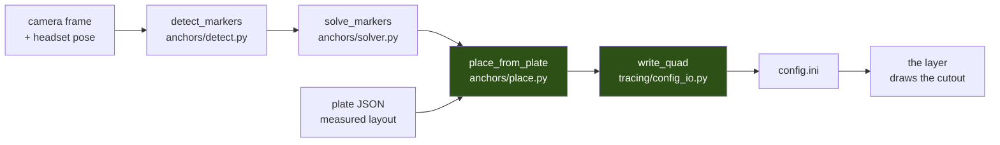

# M07 — anchored placement

Turning solved markers into cutouts, so the passthrough hole lands on the panel instead
of on eighteen numbers typed by hand.

M06 answered *where are the markers*. M07 answers *therefore where is the panel*, and
writes that into the layer's config.

## The chain



Green is what M07 added. Everything to its left already existed.

## Two ways to place a cutout

### Known layout — `place_from_plate`

A display plate's JSON records every marker centre in panel millimetres, next to the
usable rectangle. The layout is therefore **known**, not inferred, and the placement is a
rigid fit (Kabsch) of that known layout onto the solved world positions.

This is strictly better than fitting a plane through the markers:

| | plane fit | rigid fit to known layout |
|---|---|---|
| size | markers' bounding box — **69 mm** | measured panel — **118 mm** |
| centre | centre of the markers | centre of the panel |
| residual | self-consistency only | disagreement with real geometry |

The residual is the part that matters. A plane fitted through four points is always
flat-ish; a *known* layout fitted onto them cannot hide a bad solve, because the distances
between markers are fixed. **Scale is deliberately not fitted** — the panel's size is
measured, so letting scale float would quietly absorb a range error that should be visible.

### Unknown layout — `place_from_markers`

For markers whose arrangement is not recorded — loose stickers on an irregular console.
Fits a best-fit plane (smallest singular value, not three chosen points), then orients it
towards the viewer, because SVD has no notion of which side is the front.

## Frames

Two sign conventions meet here, and both are the kind of mistake that does not fail:

- **Panel coordinates run Y down**, like the screen the plate is drawn on. The cutout
  frame runs Y up. `plate_local_points` flips it. A slip here mirrors the cutout, which
  reads as a tracking fault.
- **Rotation is stored as intrinsic Euler XYZ in degrees**, composing `Rz @ Ry @ Rx`, to
  match `Config_Quad`. `matrix_to_euler_xyz` is the exact inverse of
  `euler_xyz_to_matrix` and is tested by round-tripping 200 random orientations.

## Writing the config

`config.ini` is owned by the layer **and** by the settings menu. `write_keys` therefore
rewrites only the lines it changes, and appends missing keys **inside `[Quads]`** — a key
appended at the end of file would land in whatever section came last and be silently
ignored.

Two limits come straight from `shared/config_manager.h`:

- `Config_Quad::Name` is `char[16]` read with `strncpy_s(_TRUNCATE)`, so names are cut to
  15 characters here rather than silently by the layer.
- `Enabled` is written as `true`/`false`. SimpleIni accepts `1`/`0` too, but matching what
  the layer writes keeps the file from churning on every save.

## Results on real data

Replaying the 2026-08-31 capture — 391 observations over 60 frames, 12 markers:

| plate | residual | mean per-view spread |
|---|---|---|
| winctrl-C | 1.2 mm | 4.2 mm |
| winctrl-L | 3.3 mm | 3.2 mm |
| winctrl-R | 6.0 mm | 4.4 mm |

Against the ~20 mm out-of-plane budget from [PLAN.md](PLAN.md), all three are comfortable.
The residual is the honest number: it is how far the solved constellation sits from the
panel's *measured* geometry, so it cannot be flattered by averaging.

`winctrl-R` is the worst and is also the one whose markers 8 and 11 were only ever seen
square-on — the planar ambiguity, reported rather than hidden.

**The layout names are wrong.** Solved positions put "L" at +0.21 m (to the *right* of
"C" at −0.16 m) and "R" 20 cm *below*. The names were a guess made before anything was
measured; the solve is what is true.

## The marker-derived size is a STARTING POINT, not the answer

The cutouts exist so the pilot can reach the **physical buttons around the MFDs and the
centre console**. They are not for seeing the MFD screens - the sim renders that content
in-game, and passthrough of a real display looks worse than the in-game version.

The markers can only ever measure the SCREEN, because that is what draws them. The
`unit_mm` block in each plate JSON carries the real extent:

| | screen | WinCtrl MFD unit |
|---|---|---|
| size | 118.1 x 117.8 mm | **167 x 185 mm** |
| area | 139 cm2 | **309 cm2** |

Sizing to the screen would miss more than half the unit — and the missing half is entirely
buttons. `cutout_extent` reads `unit_mm` and falls back to the screen only when a plate
does not declare one. `dx`/`dy` handle a screen aperture that is not centred in its
housing; the offset is applied **in the cutout's own plane**, since applying it in world
axes would slide the cutout off any tilted panel, which every cockpit panel is.

`--margin MM` still stacks on top, and the Quads tab's Width/Height sliders adjust it live
in 5 mm steps.

Accuracy expectations follow from this too. Reaching a button tolerates far more error
than aligning to a screen edge would, so the 1.2-6.0 mm residuals measured here are ample.

### The outline should follow the pit, not box it in

`--shaped` produces ONE cutout whose outline traces the panels. Three across the top
with one below the centre is a **T**, and a rectangle around that spends a third of its
area on cockpit side wall — passthrough there covers the game rather than revealing a
control. Measured on the real capture: 1413 cm2 against 2110 for the bounding box,
**67% of the box**, in 8 points.

Panels are grouped into rows by overlapping vertical extent, each row becomes one band,
and the bands are walked down one side and back up the other. That covers T, inverted T,
cross, L and a single row with no special cases, at four points per row — well inside
the 32-point cap. Gaps between rows are closed, because an outline is one closed loop
and cannot express two disconnected pieces.

### The sim draws the MFDs, passthrough draws the buttons

`--exclude-screens` cuts each panel's screen out of the outline as a hole. Passthrough of a
real display is worse than the rendered version, and worse still when the real panel is
showing ArUco markers rather than the sim's page.

There is no second contour in the config format or in the C++ ear clipper, so one loop has
to describe outer and holes both. **Bridging** does it: a zero-width slit from the outer
boundary to the hole, the hole walked the OPPOSITE way round, and back along the same slit.
The slit draws nothing, and the signed area comes out as outer minus holes — which is what
lets the same area assertion verify it on both sides of the port.

That cost one change in `mesh.cpp`. Bridging DUPLICATES vertices, the duplicates sit exactly
on candidate ears' corners, and `PointInTriangle` counts the boundary as inside — so every
ear looked blocked and the clipper gave up on a perfectly good outline. Coincident points
are now skipped by position rather than by index.

Budget: six points per rectangular hole. The real cockpit is **26 of 32** — 8 for the T plus
three screens. A hole that will not fit is DROPPED and reported, never truncated: a
truncated loop is not a polygon at all.

`--screen-shrink` (3 mm by default) pulls each hole in so alignment error eats into the
bezel rather than leaving a ring of camera over the screen edge. Which way to err is not
arbitrary — a little game over the bezel is invisible, a little camera over a rendered
display is not.

Measured on the real capture: **1042 cm2**, against 1413 for the solid T and 2110 for the
bounding box — 49% of the box.

### The centre console has no markers at all

`--cover-all` puts ONE cutout over the whole assembly (530 x 430 mm by default), on the
best-fit plane through every solved marker. Until stickers go on the console, this is the
only way to reach it — and it is much the quickest way to find out whether anchoring works
at all, because 2279 cm2 is impossible to miss.

The cost is flattening. Measured on the real capture, the twelve markers sit within
**24 mm** of a common plane across a 441 x 280 mm spread — far flatter than the panels'
tilts (-10.9, -7.8, -26.4 degrees) suggest, because each panel is small enough that its
tilt buys little deviation. At 0.38 m with the 15 cm camera-eye baseline that costs about
**15 mm** of sideways misalignment where the surfaces bow away from the plane:

    shift = baseline x deviation / distance^2

Fine for reaching buttons. Per-panel cutouts stay tighter if the edges need to line up.

## Usage

```bash
python scripts/place_cutouts.py
```

Replays the last capture — no camera, no headset — and prints what it would write.
`--write` commits it, keeping the previous config as `config.ini.bak`.

| flag | effect |
|---|---|
| `--capture PATH` | replay a different capture |
| `--margin MM` | grow every cutout by MM on all sides |
| `--start N` | first quad index, so earlier cutouts are left alone |
| `--cover-all [WxH]` | one rectangle over the whole assembly, mm, default `530x430` |
| `--shaped` | one cutout whose OUTLINE follows the panels — a T, not a box |
| `--exclude-screens` | cut the MFD screens out, so the SIM draws them |
| `--screen-shrink MM` | pull each screen hole in, default 3 mm |
| `--config PATH` | write somewhere else — useful for testing |

Sweep once with `scripts/solve_anchors.py`, then place as many times as you like.

## What is not done

- **Nothing re-solves at runtime.** This is a one-shot calibration written to a file. The
  live path — re-solving at 5–10 Hz on a worker thread, low-pass filtered, falling back to
  last-known pose when markers are hidden — is still ahead, and is C++ in the layer.
- **The camera offset is still a ruler measurement.** It is the one number in the whole
  chain that is not solved, so if a cutout sits *beside* its panel rather than on it,
  that is the first suspect.
- **Outlines are not placed.** A newly placed cutout is a rectangle; keeping an existing
  outline would apply the wrong shape to a different panel.
