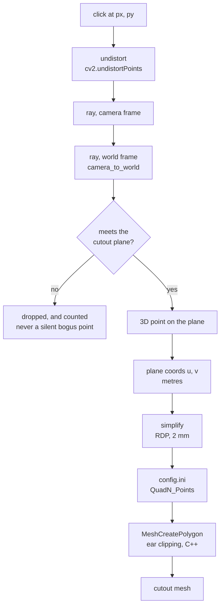

# Tracing a cutout outline

Outlines are traced by clicking around a panel in a captured camera frame. Each click is
a ray; the cutout's plane is known; the ray meets it at exactly one point. So a 2D trace
gives an exact 3D outline.

This is worth separating from alignment: a 2D capture **cannot** be used to judge
alignment, because it shows one eye at one position and parallax is invisible in it. But
tracing a shape onto a known plane is geometrically exact. An earlier note in PLAN.md
conflated the two.

## What happens to a click

Every step from the click to the config value is unit tested, including the whole chain
end to end against a synthetic frame. The ear clipping at the end has its own C++ tests -
see [testing.md](testing.md).

## Workflow

**1. Place the cutout's plane roughly** in the menu's Quads tab - position, rotation, and
enough size to cover the panel. It does not need to be accurate yet; only the plane
matters for tracing.

**2. Capture a frame** with the camera pointed at the panel:

    python scripts/trace_cutout.py capture --out captures/mip.npz

Needs the camera, SteamVR, and the headset tracking. The headset pose is stored WITH the
image, so the trace can be done later at a desk. A capture with an unknown pose would
produce a plausible but wrong outline, so this refuses rather than guessing.

**3. Trace it:**

    python scripts/trace_cutout.py trace --capture captures/mip.npz --quad 0

Left-click around the panel, right-click or backspace to undo, `s` to simplify, Enter to
save. The window shows the point count, the outline's real size in millimetres, and
whether it is self-intersecting - ear clipping rejects a self-intersecting outline and the
layer silently falls back to a rectangle, so it is worth catching while still drawing.

**4. Re-read it.** The layer loads outlines from the config file, so restart the app or
toggle a setting in the menu to trigger a reload.

## Try it with no hardware

    python scripts/trace_cutout.py demo
    python scripts/trace_cutout.py trace --capture captures/demo.npz --quad 0 --pose-from-demo

`demo` renders a synthetic L-shaped panel on a known plane. Tracing it prints the outline
instead of writing to the config, so the whole workflow can be exercised - and the result
checked against a known answer - before the cockpit exists.

## Accuracy

A click is accurate to about a pixel. At cockpit distance that is **under 2 mm** on the
plane, against the ~2 cm out-of-plane budget in PLAN.md, so tracing is not the limiting
factor. There is a test asserting exactly this.

## Limits

- The outline is only as good as the **plane's pose**. A misplaced plane gives a
  correctly-shaped outline in the wrong place. Anchors (M06/M07) fix the pose; tracing
  fixes the shape. They are independent, which is why the outline is stored in plane
  coordinates and survives the pose being re-solved later.
- 32 points per cutout, matching `MAX_QUAD_POLYGON_POINTS`. `s` simplifies a dense trace
  within a 2 mm tolerance, which is far below anything visible.
- One plane per cutout. A panel that bulges more than ~2 cm off flat needs splitting -
  see the depth discussion in PLAN.md.
